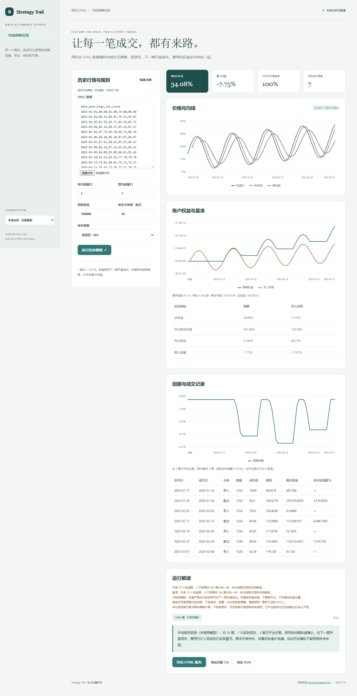

# Strategy Trail

用历史 OHLC 数据模拟均线交叉策略，把信号、下一期开盘成交、费用和权益变化串在一起。

- 仅做多、整股、双均线严格交叉
- 下一期开盘执行，逐笔计算费用与现金
- 权益、回撤与买入持有基准
- 完整交易日志及 HTML / CSV / JSON 导出



## 快速开始

需要 Node.js 24 或更新版本；无第三方运行依赖，无需 npm install。

```sh
git clone https://github.com/Yiwen-Yang-BA/chatgpt-strategy-trail.git
cd chatgpt-strategy-trail
npm start
```

打开 http://127.0.0.1:3206 。默认进入**本地分析模式**，不调用 API；统计值由本地代码计算。示例数据为人工构造，界面明确标注。

### 接入真实模型

复制 `.env.example` 为 `.env`，填写 `OPENAI_API_KEY`，按账号权限设置 `OPENAI_MODEL`，然后重启服务并切换界面中的「AI 解读」。`OPENAI_BASE_URL` 必须支持 OpenAI Responses API；仅兼容 Chat Completions 的服务不适用。密钥只在服务端读取，不写入前端或仓库。

```sh
# Docker（可选；必须显式传入配置）
docker build -t chatgpt-strategy-trail .
docker run --rm -p 127.0.0.1:3206:3206 --env-file .env chatgpt-strategy-trail
```

## 使用方法

1. 导入 date,open,high,low,close CSV，日期严格升序；数据须使用同一复权口径。
2. 设置快慢窗口、初始现金、手续费和每年期数。
3. 运行回测，核对价格均线、权益与成交记录。
4. 下载历史模拟报告；构造示例不代表真实市场或未来收益。

## 计算口径

两期快慢均线均成熟后才判断严格交叉；相等不发信号。第 t 期收盘确认信号，第 t+1 期开盘执行。只买整股，数量=floor(现金/(开盘价×(1+单边手续费率)))；卖出全部持仓，买卖各收实际费用。每期收盘权益=现金+数量×收盘价，初始现金作为首个权益点。最后持仓按末收盘价估值，不强制平仓、不计未发生的退出费；最后信号无下一期开盘则不成交。基准在首期开盘按同样费用买入并持有。胜率仅统计已经买入并卖出的完整交易，盈亏包含双边费用；无已平仓交易时胜率未定义。年化收益、样本波动及回撤按观测期数与频率计算，不是自然日 CAGR。无杠杆、无滑点、无分红拆股调整；价格范围 0.000001–1e12，现金不超过1e12；异常数值精度直接报错。参考 [Backtesting.py 官方执行规则](https://kernc.github.io/backtesting.py/doc/backtesting/backtesting.html)。

## 验证

```sh
npm run check
npm test
```

测试覆盖业务规则以及本地 HTTP 服务、模拟模型接口、输入校验和错误处理。真实付费模型调用需要用户配置有效密钥，未将本地分析测试作为真实模型质量验证。GitHub Actions 在每次推送时运行检查。

## 参考与复刻范围

灵感来自 [kernc/backtesting.py](https://github.com/kernc/backtesting.py)（AGPL-3.0）。查询快照：2026-10-04；9,007 stars；最近推送 2026-08-05。这是当前星标量与更新状态，**不是近一个月新增星标排名**。

本仓库是对其核心交互和用途的独立轻量实现，未复制上游源码、商标或静态资源，不声称实现上游的全部功能，也不属于上游官方产品。

独立复刻仅做多的简单均线交叉回测，导入历史 OHLC 数据，收盘信号在下一可交易时点执行，显式计算手续费、现金与持仓并展示交易日志和买入持有基准。固定规则模拟，不使用未来数据，不含杠杆、券商连接、真实下单或自动策略搜索。

## 模型接收的数据

模型仅接收参数、历史表现指标、期末账户摘要与交易计数，不发送原始 OHLC 或逐笔交易日志。

## 数据与部署边界

输入仅在当前页面中使用。不会连接券商或执行实际交易。 本地分析数据不离开本机；AI 解读仅发送本项目 README 说明的统计摘要到所配置的模型服务。

默认只监听 127.0.0.1，适用于单人本地使用；没有多用户登录或持久数据库。如需公网部署，请先增加身份验证、配额和 HTTPS。服务限制请求大小、并发和超时，禁止从静态目录读取密钥文件。

接口实现依据 [OpenAI 官方文本生成文档](https://developers.openai.com/api/docs/guides/text)。

## License

MIT — independent implementation.
